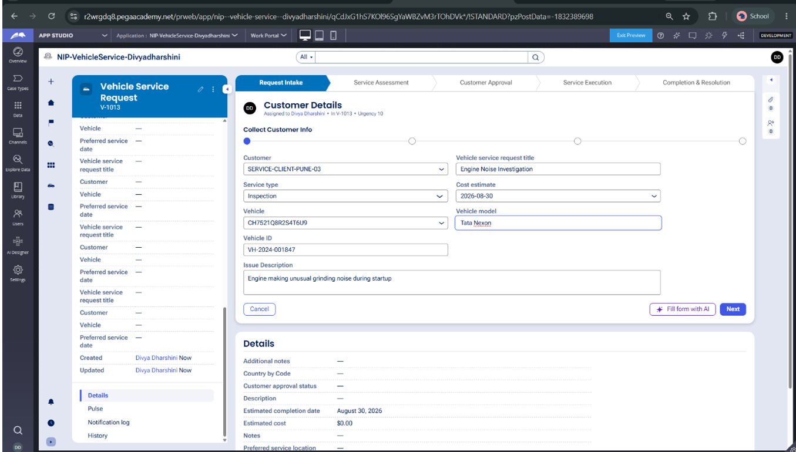
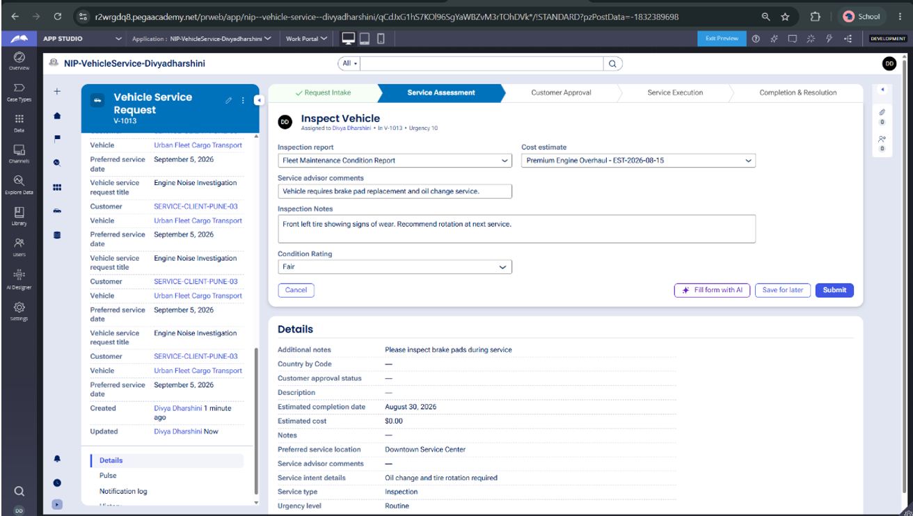
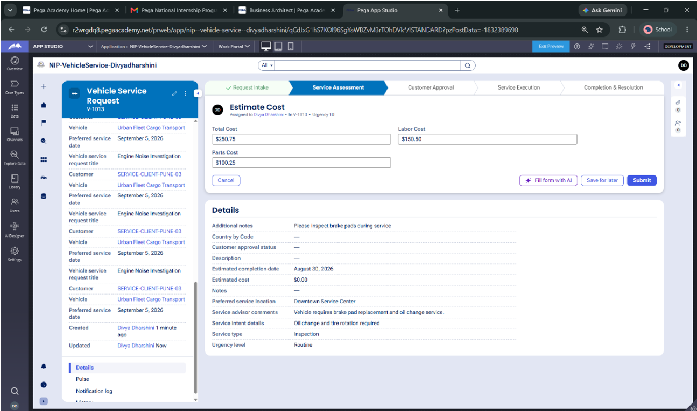
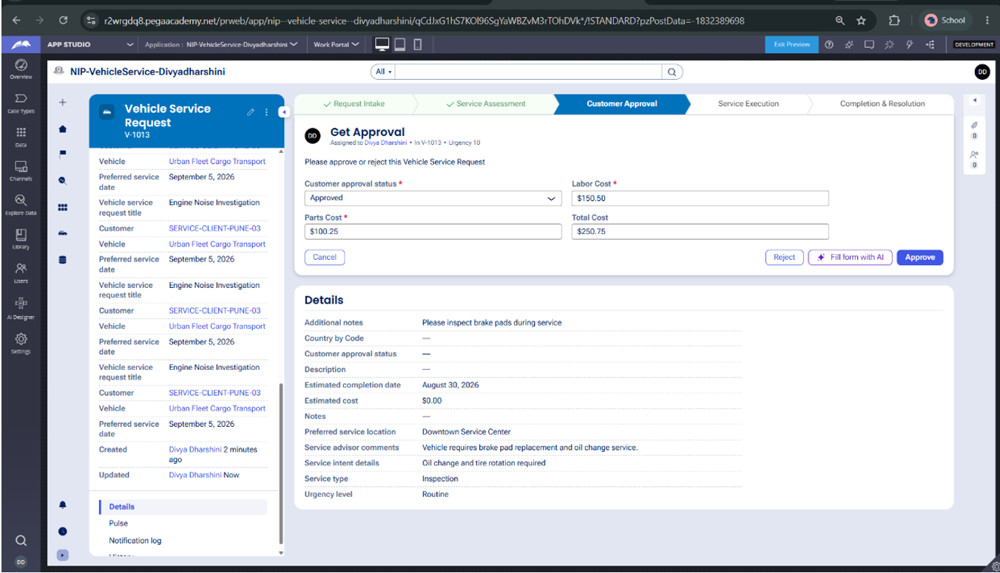
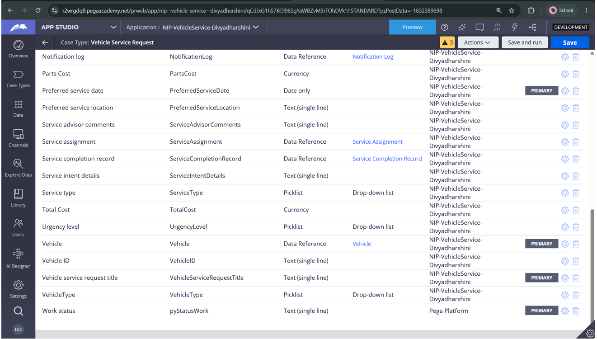
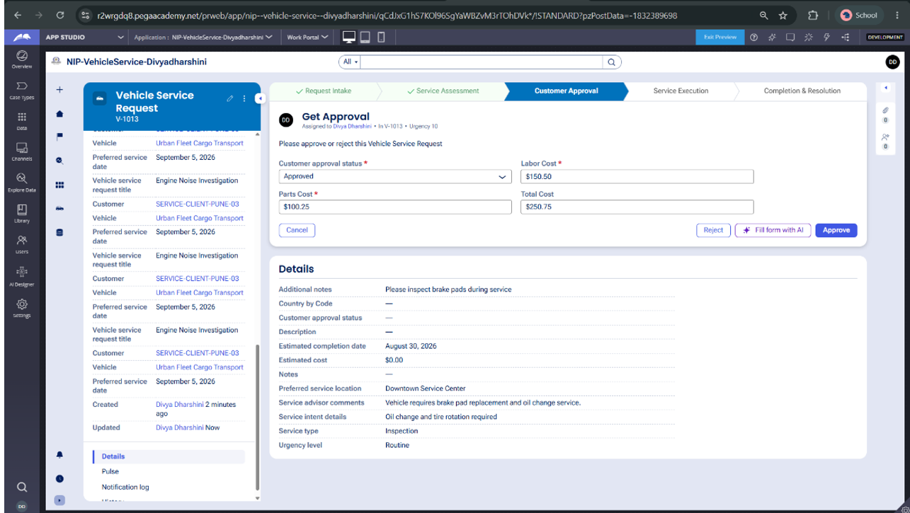
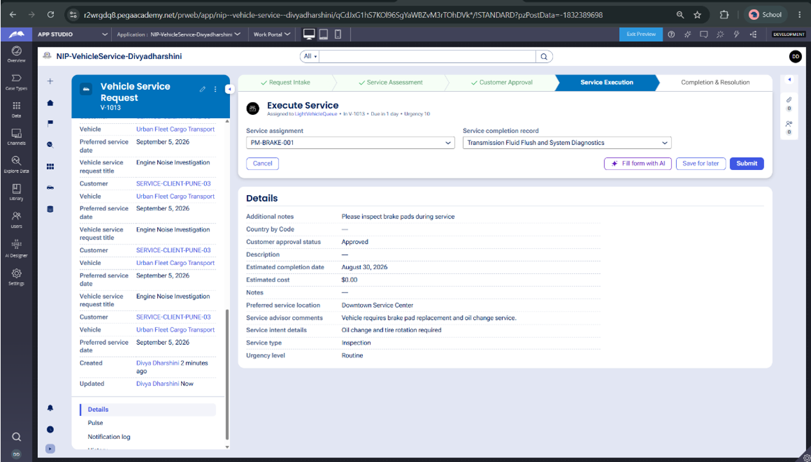
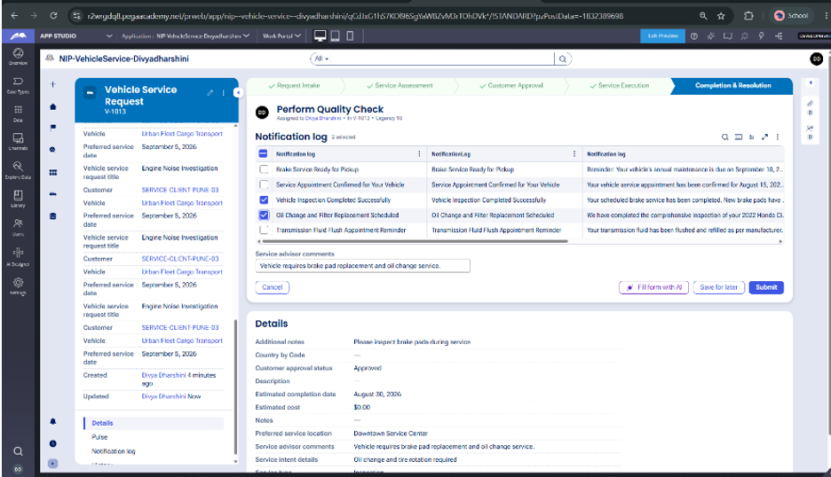
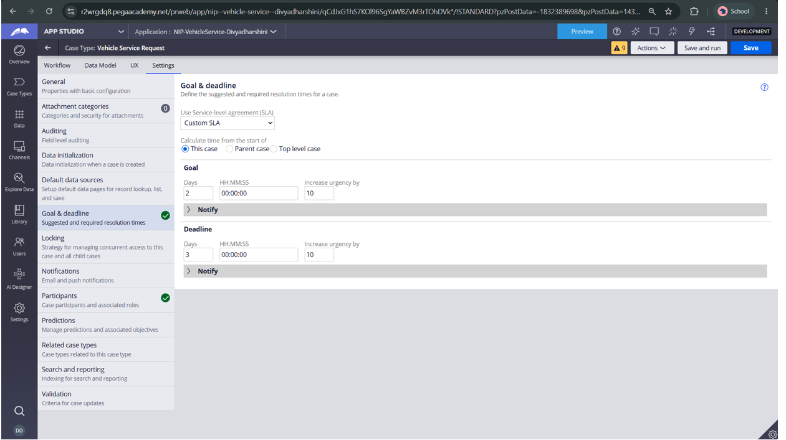
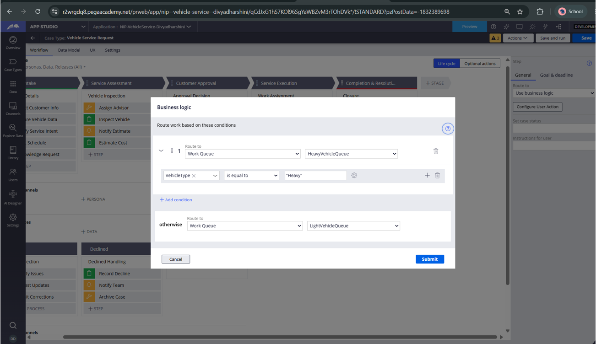

# 🚗 Vehicle Service Management Application

<p align="center">

### A Pega-powered solution for streamlined and automated vehicle service management

**Pega National Internship Program — Capstone Project**

</p>

<p align="center">


</p>

---

## 📌 Project Overview

The **Vehicle Service Management Application** is a workflow-driven application developed using **Pega Platform App Studio** as part of the **Pega National Internship Program**.

The application is designed for **Urban Fleet Operations** to replace traditional service-request methods such as manual phone calls, emails, and unstructured communication with a centralized digital workflow.

It manages the complete vehicle servicing lifecycle — from **service request submission and vehicle inspection to service estimation, approval, technician assignment, service completion, SLA management, vehicle-type routing, and final resolution**.

### 🎯 Project Objective

> To develop an automated vehicle service management solution that improves service request tracking, operational visibility, workflow efficiency, customer approval, technician assignment, and service completion.

---

# ✨ Key Features

* 🚘 Vehicle Service Request Management
* 📝 Structured Service Request Intake
* 🔍 Vehicle Inspection
* 💰 Service Estimate Generation
* ✅ Customer Estimate Approval
* 👤 Customer Data Management
* 🚗 Vehicle Data Management
* 👨‍🔧 Automatic Technician Assignment
* 🔄 Automated Case Routing
* 🚙 Vehicle-Type-Based Routing
* ⏱️ Service SLA Management
* 🛠️ Service Completion Tracking
* 📚 Service History Management
* 📊 End-to-End Case Lifecycle Management

---

# 🏢 Application Details

| Property                    | Details                                |
| --------------------------- | -------------------------------------- |
| **Program**                 | Pega National Internship Program       |
| **Project Name**            | Vehicle Service Management Application |
| **Platform**                | Pega Platform                          |
| **Development Environment** | Pega App Studio                        |
| **Target Organization**     | Urban Fleet Operations                 |
| **Application Name**        | `NIP-VehicleService-Divyadharshini`    |
| **Case Type**               | `Vehicle Service Request`              |
| **Project Status**          | ✅ Completed                            |

---

# 🎯 Problem Statement

Traditional vehicle service management often depends on phone calls, emails, spreadsheets, and manual coordination.

This can lead to:

* Lack of centralized service information
* Difficulty tracking service requests
* Delayed customer approvals
* Manual technician assignment
* Poor visibility into service progress
* Difficulty monitoring service-level timelines
* Inconsistent service records
* Increased operational effort

The proposed Pega application addresses these challenges through a **centralized case management and workflow automation solution**.

---

# 💡 Proposed Solution

The application provides a structured workflow where every vehicle service request becomes a **Pega case**.

The case progresses through predefined stages with appropriate data collection, routing, approval, assignment, SLA tracking, and resolution.

```text
Customer
   │
   ▼
Service Request
   │
   ▼
Vehicle Inspection
   │
   ▼
Service Estimate
   │
   ▼
Customer Approval
   │
   ▼
Technician Assignment
   │
   ▼
Vehicle-Type Routing
   │
   ▼
Service Execution
   │
   ▼
Service Completion
   │
   ▼
Final Resolution
```

---

# 🧩 User Stories Implemented

The application implements **10 user stories** covering the major stages of vehicle service management.

---

## US-001 — Submit Service Request

Customers can submit a vehicle service request by providing relevant information.

### Information captured includes:

* Customer details
* Vehicle details
* Reported vehicle issues
* Preferred service date
* Service requirements

This creates a structured **Vehicle Service Request case**.

### 📸 Screenshot



---

## US-002 — Vehicle Inspection

Service advisors can inspect the vehicle and record the required inspection information.

### Features:

* Inspection notes
* Vehicle condition
* Identified issues
* Recommended services
* Maintenance requirements

### 📸 Screenshot



---

## US-003 — Service Estimate

The application supports the creation of a service estimate based on the identified service requirements.

### Features:

* Service cost calculation
* Estimated completion date
* Service details
* Estimated service information

### 📸 Screenshot



---

## US-004 — Approve Estimate

Customers can review the generated service estimate before service execution.

The approval stage ensures that service activities proceed only after the required customer approval.

### Workflow

```text
Service Estimate
       │
       ▼
Customer Review
       │
       ▼
Approval
       │
       ▼
Service Execution
```

### 📸 Screenshot



---

## US-005 — Vehicle Data

The application maintains structured vehicle-related information throughout the service lifecycle.

### Vehicle information includes:

* Vehicle details
* Vehicle model
* Vehicle type
* Service-related information
* Historical service information

### 📸 Screenshot



---

## US-006 — Review Service Estimate

The service estimate can be reviewed as part of the service management workflow before moving toward execution.

This stage provides visibility into the estimated service requirements and associated information.

### 📸 Screenshot



---

## US-007 — Automatic Technician Assignment

The application supports automated technician assignment to improve service workflow efficiency.

Instead of relying completely on manual assignment, the workflow can automatically route the service case to the appropriate technician.

### Benefits:

* Reduced manual coordination
* Faster case assignment
* Improved workflow automation
* Better technician allocation

### 📸 Screenshot



---

## US-008 — Service Completion

Once the required service activities are completed, the service case progresses toward completion.

The workflow provides a structured way to capture and manage the completion stage.

### 📸 Screenshot



---

## US-009 — Service SLA

The application incorporates **Service Level Agreement (SLA)** management to help monitor service timelines.

SLA-based workflow management helps improve:

* Timely service processing
* Case monitoring
* Operational accountability
* Service efficiency

### 📸 Screenshot



---

## US-010 — Route Vehicle Type

The application supports routing based on vehicle type.

This enables the service request to be directed according to the relevant vehicle category and operational requirements.

### Benefits:

* Appropriate service routing
* Better workflow organization
* Reduced manual decision-making
* Improved operational efficiency

### 📸 Screenshot



---

# 🔄 Complete Case Lifecycle

The complete workflow can be represented as:

```text
┌──────────────────────────┐
│  1. Submit Service       │
│     Request              │
└────────────┬─────────────┘
             │
             ▼
┌──────────────────────────┐
│  2. Vehicle Inspection   │
└────────────┬─────────────┘
             │
             ▼
┌──────────────────────────┐
│  3. Generate Service     │
│     Estimate             │
└────────────┬─────────────┘
             │
             ▼
┌──────────────────────────┐
│  4. Customer Approval    │
└────────────┬─────────────┘
             │
             ▼
┌──────────────────────────┐
│  5. Review Estimate      │
└────────────┬─────────────┘
             │
             ▼
┌──────────────────────────┐
│  6. Assign Technician    │
└────────────┬─────────────┘
             │
             ▼
┌──────────────────────────┐
│  7. Route by Vehicle     │
│     Type                 │
└────────────┬─────────────┘
             │
             ▼
┌──────────────────────────┐
│  8. Service Execution    │
└────────────┬─────────────┘
             │
             ▼
┌──────────────────────────┐
│  9. SLA Monitoring       │
└────────────┬─────────────┘
             │
             ▼
┌──────────────────────────┐
│ 10. Service Completion   │
│     & Resolution         │
└──────────────────────────┘
```

---

# 🏗️ Application Architecture

The application follows a **case-based workflow architecture** using Pega Platform.

```text
                    ┌───────────────────┐
                    │     Customer      │
                    └─────────┬─────────┘
                              │
                              ▼
                  ┌───────────────────────┐
                  │ Vehicle Service       │
                  │ Request Case          │
                  └───────────┬───────────┘
                              │
             ┌────────────────┼─────────────────┐
             │                │                 │
             ▼                ▼                 ▼
       Request Intake   Vehicle Inspection   Estimate
             │                │                 │
             └────────────────┼─────────────────┘
                              │
                              ▼
                    Customer Approval
                              │
                              ▼
                     Estimate Review
                              │
                              ▼
                  Technician Assignment
                              │
                              ▼
                    Vehicle-Type Routing
                              │
                              ▼
                    Service Execution
                              │
                              ▼
                    SLA / Monitoring
                              │
                              ▼
                    Service Completion
                              │
                              ▼
                         Resolution
```

---

# 🛠️ Technology Stack

| Technology               | Purpose                              |
| ------------------------ | ------------------------------------ |
| **Pega Platform**        | Workflow and application development |
| **Pega App Studio**      | Low-code application development     |
| **Pega Case Management** | Vehicle service case lifecycle       |
| **Pega Workflow**        | Automated process routing            |
| **Pega Data Model**      | Customer and vehicle information     |
| **Pega SLA**             | Service timeline management          |
| **GitHub**               | Repository and project documentation |

---

# 🗂️ Data Management

The application manages structured information related to:

### 👤 Customer Data

* Customer profile
* Contact information
* Service request information

### 🚗 Vehicle Data

* Vehicle information
* Vehicle model
* Vehicle type
* Service requirements

### 🔧 Service Data

* Inspection details
* Required services
* Service estimate
* Completion information

### 📚 Service History

Service-related information can be maintained across the case lifecycle for better historical visibility.

---

# 🔐 Workflow & Automation

The application uses Pega's workflow capabilities to automate important business processes.

### Automated capabilities include:

* Case routing
* Customer approval
* Technician assignment
* Vehicle-type routing
* SLA management
* Case progression
* Service completion
* Resolution handling

This reduces dependency on manual coordination and creates a consistent service process.

---

# 🧪 Testing & Validation

The application was tested to validate the complete vehicle service lifecycle.

## ✅ End-to-End Test Case

**Test Case:** `V-1013`

The test verified successful case progression through the major workflow stages.

```text
Request Intake
      ↓
Service Assessment
      ↓
Customer Approval
      ↓
Service Execution
      ↓
Completion & Resolution
```

### Final Result

The test case successfully completed the lifecycle and reached:

```text
RESOLVED-UNSPECIFIED
```

---

# 🐛 Issue Identified & Resolved

During testing, a routing issue was identified in the customer approval workflow.

### 🔴 Problem

An unnecessary **Decline branch and connector** was present in the approval flow, resulting in incorrect routing behavior.

### 🛠️ Resolution

The redundant **Decline branch and connector** were removed from the workflow.

The application was then retested to confirm that the case progressed correctly.

### 🟢 Result

* ✅ Approval routing corrected
* ✅ Case progressed successfully
* ✅ Workflow completed successfully
* ✅ End-to-end lifecycle validated

---
spection.png" width="900">
</p>

---

# 📊 Project Outcomes

The completed application demonstrates how a traditional vehicle servicing process can be transformed into a centralized digital workflow.

### Key Outcomes

| Area                  | Outcome                         |
| --------------------- | ------------------------------- |
| Service Requests      | Centralized digital intake      |
| Inspection            | Structured inspection workflow  |
| Estimates             | Standardized service estimation |
| Approval              | Customer approval workflow      |
| Technician Assignment | Automated assignment            |
| Routing               | Vehicle-type-based routing      |
| SLA                   | Service timeline monitoring     |
| Completion            | Structured completion process   |
| Tracking              | End-to-end case visibility      |

---

# 🚀 Future Enhancements

The application can be further enhanced with:

* 📱 Customer self-service portal
* 🔔 Automated email and SMS notifications
* 💳 Online payment integration
* 📅 Appointment scheduling
* 📊 Fleet maintenance dashboards
* 📈 Advanced service analytics
* 🤖 AI-based maintenance recommendations
* 🔧 Predictive vehicle maintenance
* 📍 Service center tracking
* ⭐ Customer feedback and service ratings
* 📱 Mobile-friendly service management

---

# 🎓 Learning Outcomes

Through this capstone project, practical experience was gained in:

* Pega Platform
* Pega App Studio
* Low-code application development
* Case lifecycle management
* Workflow configuration
* Data modeling
* Approval routing
* Automated assignment
* SLA configuration
* Conditional routing
* Application testing
* Workflow debugging
* End-to-end business process automation

---

# 📁 Repository Structure

```text
NIP-VehicleService-Divyadharshini/
│
├── README.md
│
└── screenshots/
    │
    ├── US-001-Submit-Service-Request.png
    ├── US-002-Vehicle-Inspection.png
    ├── US-003-Service-Estimate.png
    ├── US-004-Approve-Estimate.png
    ├── US-005-Vehicle-Data.png
    ├── US-006-Review-Service-Estimate.png
    ├── US-007-Auto-Assign-Technician.png
    ├── US-008-Service-Completion.png
    ├── US-009-Service-SLA.png
    └── US-010-Route-Vehicle-Type.png
```

---

# 🔗 Project Repository

<p align="center">

<a href="https://github.com/divyadharshini2028/NIP-VehicleService-Divyadharshini">
  
</a>

</p>

**GitHub Repository:**
https://github.com/divyadharshini2028/NIP-VehicleService-Divyadharshini

---

# 🏁 Project Status

<p align="center">

### ✅ CAPSTONE PROJECT COMPLETED

**Pega National Internship Program**

**Vehicle Service Management Application**

</p>

---

## 👩‍💻 Developer

**Divyadharshini**

**B.Tech – Artificial Intelligence and Data Science**

🎓 **Bannari Amman Institute of Technology**

### 💻 Passionate About

* 🤖 Artificial Intelligence
* 📊 Data Science
* ⚡ Low-Code Development
* 🔄 Workflow Automation
* 🧠 Intelligent Applications

---

<div align="center">

## ⭐ Thank You for Visiting This Project!

### 🚗 Transforming Vehicle Service Management Through Intelligent Workflow Automation

**Built with ❤️ using Pega Platform**

⭐ **If you found this project interesting, consider giving the repository a star!** ⭐

</div>
